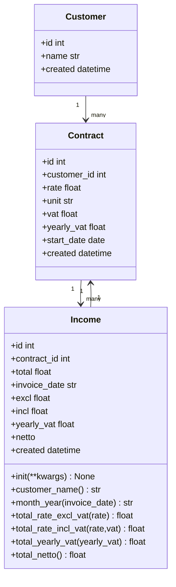

## MyAccountant

```mermaid
classDiagram
    class Customer
    Customer: +id int
    Customer: +name str
    Customer: +created datetime

    class Contract
    Contract: +id int
    Contract: +customer_id int
    Contract: +rate float
    Contract: +unit str
    Contract: +vat float
    Contract: +yearly_vat float
    Contract: +start_date date
    Contract: +created datetime

    Customer "1" --> "many" Contract

    class Income
    Income: +id int
    Income: +contract_id int
    Income: +total float
    Income: +invoice_date str
    Income: +excl float
    Income: +incl float
    Income: +yearly_vat float
    Income: +netto
    Income: +created datetime

    Income: +init(**kwargs) None
    Income: +customer_name() str
    Income: +month_year(invoice_date) str
    Income: +total_rate_excl_vat(rate) float
    Income: +total_rate_incl_vat(rate,vat) float
    Income: +total_yearly_vat(yearly_vat) float
    Income: +total_netto() float


    Income "1" --> "1" Contract
    Contract "1" --> "many" Income
    
```
