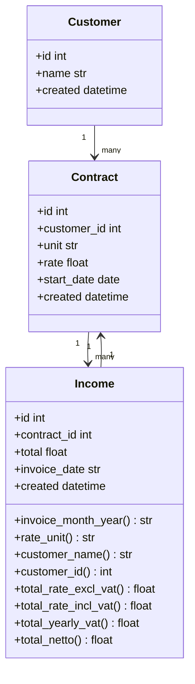

# MyAccountant
--------------
is an API created to help me manage my invoices. I can create, modify and get an overview of my incomes with and without tax. It also reminds my of uploading receipts to my accountant app.
This api is built using Python FastAPI.

## Changelogs
All change logs can be found [here](CHANGELOG.md)

## Authors
Omar Aljazairy: omar@fedal.nl

## Class Diagram
----------------

## Usage
--------

- To start the app, first run the container:
  make start 
- To enter the container
  make bash
- To unittest the application
  make test
